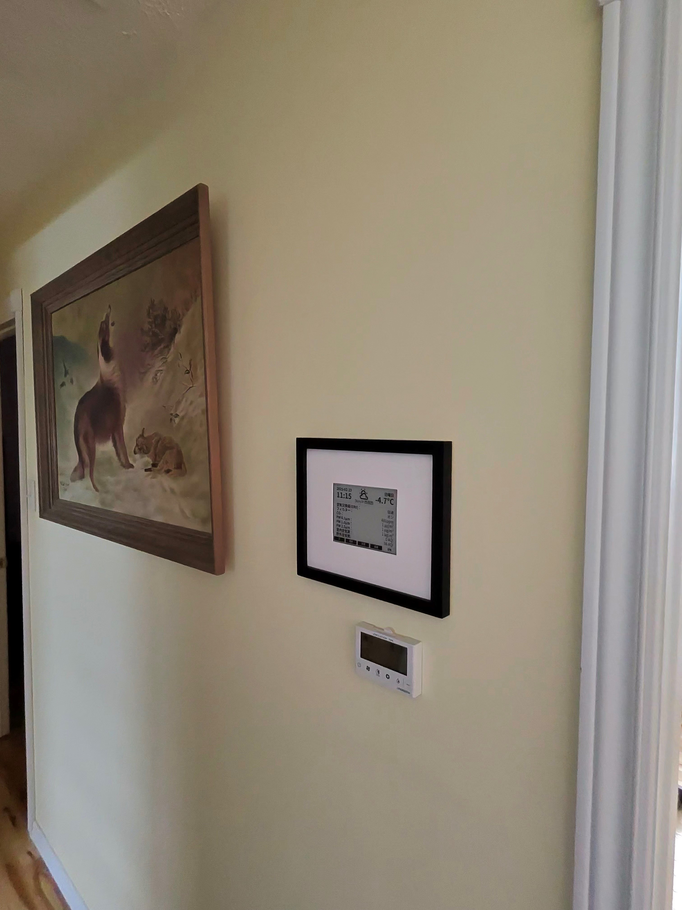
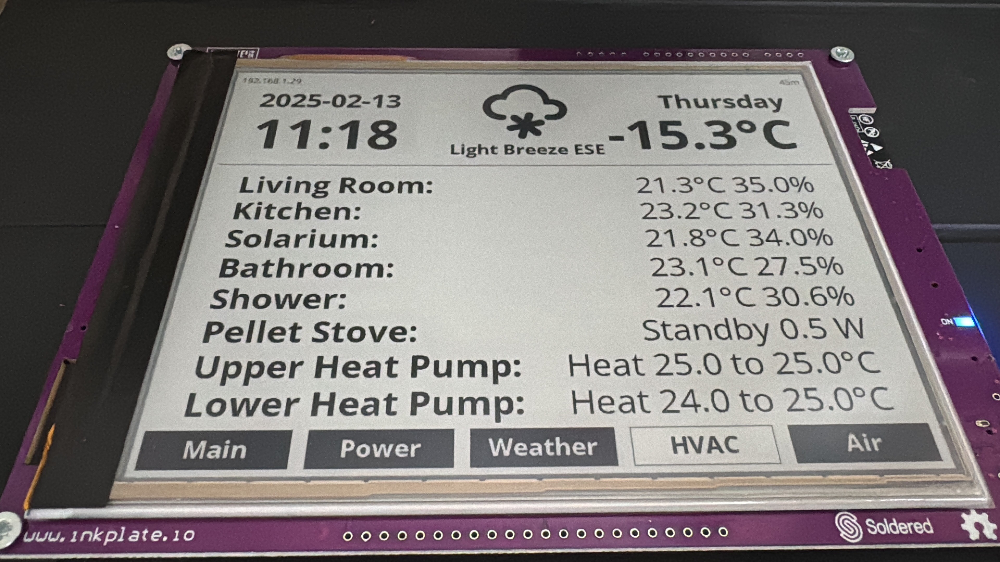
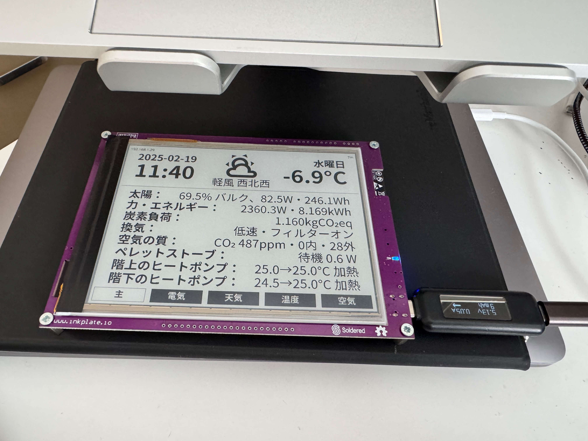
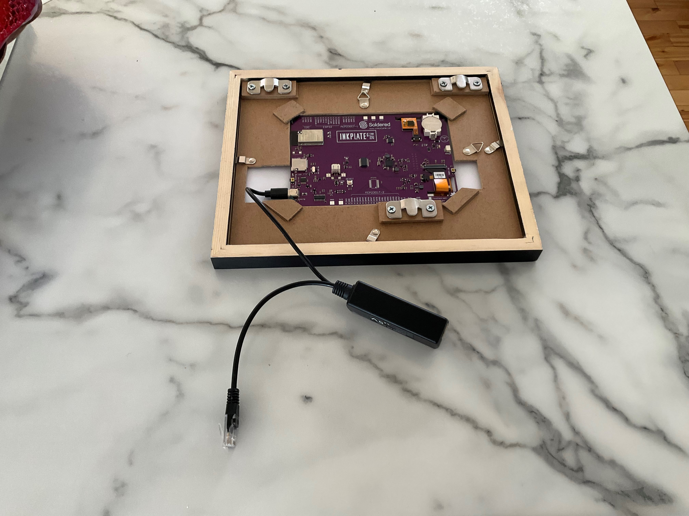
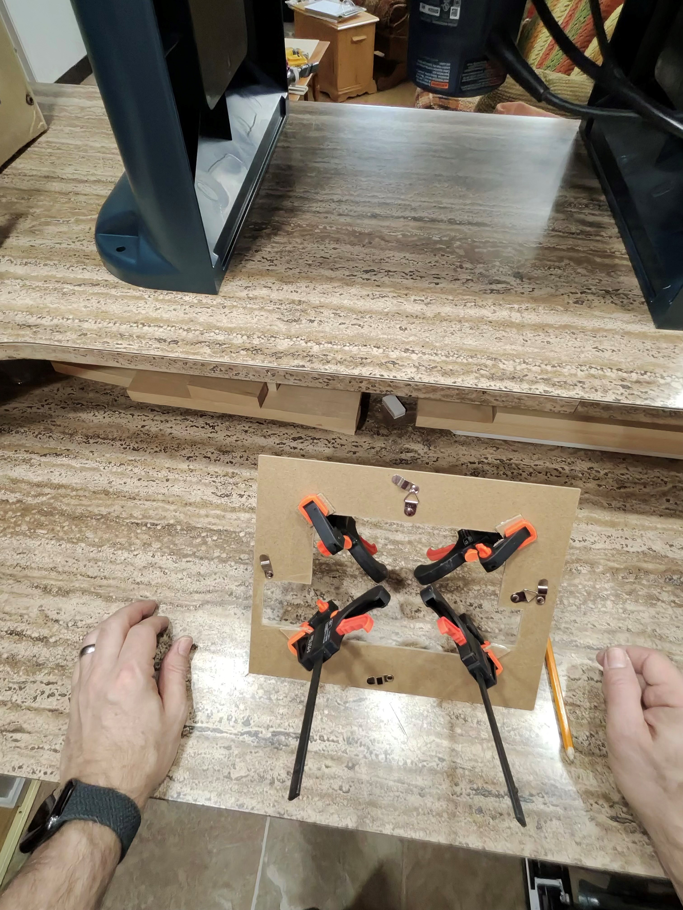

# ESPHome Inkplate Dashboard
ESPHome configuration for IoT/Home Assistant dashboard based on Inkplate 6PLUS.
Note that the 6PLUS is no longer available but something *like* this will probably work for the [Inkplate 6FLICK](https://soldered.com/product/inkplate-6flick/).

See TO DOs in YAML file for things that I still want to fix. 

 <em>
Dashboard mounted on wall.</em>

 <em>
Dashboard mounted on wall - closeup.</em>

 <em>
English content on dashboard.</em>

 <em>
Japanese content on dashboard.</em>

 <em>
Back of dashboard, with POE adapter for power.  Cutout to allow clearance for USB C cable.  Note that for larger displays and/or smaller frames
the VIN/GND pads on the back, or a battery, could be used for power instead. Other cutouts are for accessing buttons.</em>

 <em>
Frame was modified by cutting out center for board, then gluing on some scraps in the corners to hold board in place.
Some small gel pads were added under corners to keep it from shifting around.
A custom mat had to be cut as the size of the display is unfortunately not a standard photo size.</em>
